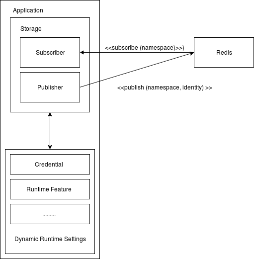

# Rust Meetup #02
### What can you do with Rust in about X minutes

###### Yuri Setiantoko \<r1nlx0@gmail.com\>
---

<!-- page_number: true -->

1/4 day ~ 360 minutes ;))

---

## Idea

- Central is like a cache of your key value from Redis/Consul.
- This key-value can be mapped as a struct at runtime.
- By caching the settings (less Read I/O) in memory, this could reduce I/O in Redis/Consul.
- We solve distributed synchronization (if being used in multiple process) by using an identity per an event.
- Currently, it's being implemented as my side project in Ruby (as gem).
- Let's port this into Rust.

---

## Idea (example in Ruby)


```ruby
class Credential
   # any gory details are being handled in here
   include Central::Feature

   attr :host, String
   attr :username, String
   attr :password, String
end

credential = Credential.new()

# this change value in Redis and publish an event to Redis
# then any subscribers (Credential instance) need to update 
# their host value 
credential.host = "127.0.0.1"
puts credential.username

```
---

## Idea (example in Rust)

```rust
extern crate central;
extern crate central_feature;

feature! Credential {
   attr! host, String
   attr! username, String
   attr! password, String
}

let credential = Credential::new();
let mut handlers = HashMap::new();
let mut handler = credential.handler_mut();
handlers.insert(handler.key, handler.func);

let storage = central::storage::RedisStore::new("redis://127.0.0.1", "central", handlers);

let host = credential.host();
let _ = credential.set_host("127.0.0.1").unwrap();

```

---

## Development

---

## Development (cont.)

1. Create Subscriber and Storage handler for Redis (abstract it away)
2. Create macro that implement struct that interact with Storage (so that developer doesn't need to know about the gory details).

---

## Architecture (overview)



---

## Code (explanation)

---

## TODO (Next)

- TODO in #1 : 
  - Subscriber should be able to shutdown gracefully
  - There's still a lot of `unwrap()`, need to clean this up.
  - Some `Mutex` and `Arc` may not be needed in several areas.
  - Should use random number too as an identity
  - Need to handle some error in subscriber thread handle (timeouts, connection reset, etc).
- Development point #2 still not yet done :((.